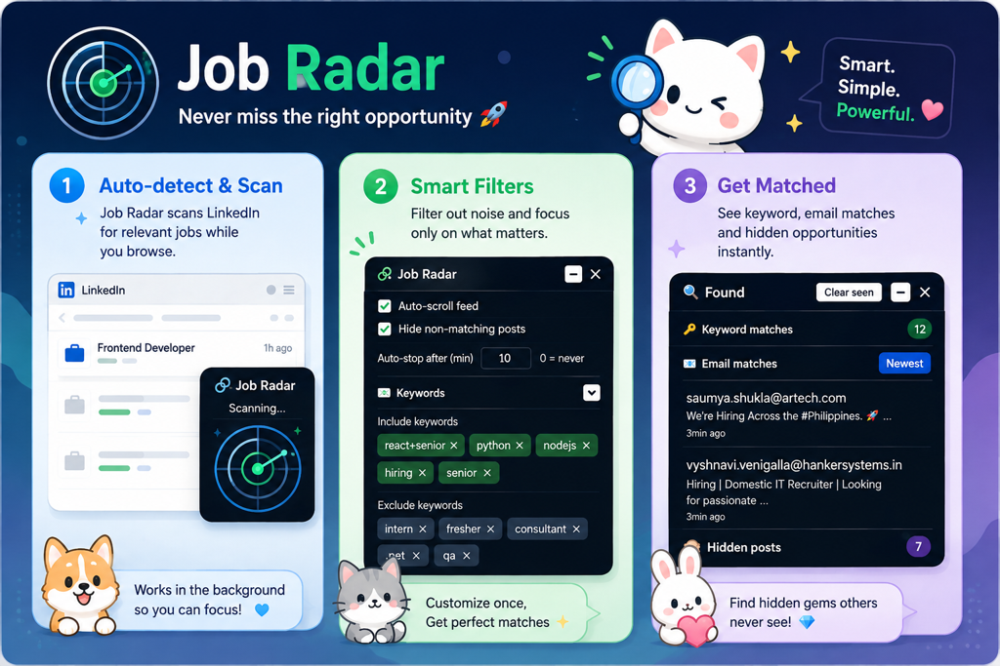

# 🕵️ Job Radar for LinkedIn

<p align="center">
  
</p>

<p align="center">
  
</p>

A **Chrome (Manifest V3) extension** that finds hiring posts, email addresses, and keyword matches on your LinkedIn feed — plus a **connection assistant** that sends requests one-by-one with a safe, configurable delay.

> ✅ **Available on the Chrome Web Store** — [Install Job Radar for LinkedIn](https://chromewebstore.google.com/detail/job-radar-for-linkedin/fohdibajaklenoedegbhabemcogdcfke) · [GitHub repo](https://github.com/syntaxhacker/linkedin-auto-connector) · [Releases](https://github.com/syntaxhacker/linkedin-auto-connector/releases)

> ⚠️ **Use responsibly.** Automating connection requests can violate LinkedIn's Terms of Service and may risk account restrictions. Keep delays reasonable, respect rate limits, and use this tool at your own risk.

---

## ✨ Features

### 🤝 Auto-Connect
- **Scan** a search-results page and highlight every "Connect" button (blue glow)
- **Start** sends requests one-by-one with a random, configurable delay (default 1.5–3 s)
- **Skips 3rd-degree connections and Intern listings** automatically
- Live status badge on the page: connected / skipped counts + per-person log
- Visual **state colors** on the buttons you're automating:
  - 🟦 blue = found & highlighted
  - 🟨 amber = currently sending
  - 🟩 green = connected
  - 🟥 red = failed / no dialog

### 📬 Feed Email & Keyword Scanner
- Scans your LinkedIn feed for **email addresses** and posts matching your **include keywords** — matching reads the post body only (profile headlines are ignored)
- Floating **Found panel** with three lists (🔑 Keyword matches / 📧 Email matches / 🙈 Hidden posts):
  - **Keyword matches** — posts containing your include keywords
  - **Email matches** — posts containing email addresses (a post with both shows only under emails)
  - **Hidden posts** — posts you've collapsed via exclude keywords, each showing *why* (the matching keyword) with per-post **Show**/**Hide** and click-to-scroll
  - click-to-jump (smooth-scrolls to the post and flashes it)
  - **✓ seen chip** — green badge + green row tint once you've viewed a hit
  - **Clear seen** — removes viewed rows from the lists (a green marker stays on those feed posts until **Reset** so you know why they're gone)
  - newest-first sort by default, relative "time ago" labels
- **Hide posts** matching your **exclude keywords** (collapsed snippet, amber stripe; hover to peek)
- **Hide non-matching posts** — a toggle that collapses every post that isn't a keyword or email match
- **Auto-scroll** the feed with an optional time limit (0 = never)
- **Right-click any post → "Add post to Include/Exclude keywords"** (top 3 most frequent words are extracted from the post body)

---

## 🚀 Install

**Recommended:** install from the [Chrome Web Store](https://chromewebstore.google.com/detail/job-radar-for-linkedin/fohdibajaklenoedegbhabemcogdcfke) — you'll get automatic updates. Store-version zips are attached to each [GitHub release](https://github.com/syntaxhacker/linkedin-auto-connector/releases).

### Developers: load unpacked

1. Clone this repo
2. Open `chrome://extensions`
3. Enable **Developer mode** (toggle, top-right)
4. Click **Load unpacked** → select the folder containing `manifest.json`
5. Go to a LinkedIn search-results page → click the extension icon → **🔍 Search** → **▶ Start**

> The extension runs on `*://*.linkedin.com/*` and needs `storage` (settings), `activeTab` (scan), and `contextMenus` (right-click keyword add) permissions.

---

## 📖 Usage

| Control | What it does |
|---|---|
| 🔍 **Search** | Scans the current page, highlights Connect buttons (blue) |
| ▶ **Start** | Sends requests sequentially with the configured delay |
| ⏹ **Stop** | Stops after the current step |
| ↺ **Reset** | Clears counters, highlights, panels, and auto-scroll state |
| **Delay (ms)** | Random range between requests (min ≥ 500, min ≤ max) |

### Feed panel
- **Auto-scroll feed** — toggle; optional auto-stop after N minutes
- **Include keywords** — comma/Enter separated; `react+senior` means *all* parts must match; matching posts get an **amber outline**
- **Exclude keywords** — matching posts collapse to a dim snippet with an amber stripe (hover to expand); they appear in the Found panel's **Hidden posts** list with the reason and a per-post Show/Hide
- **Hide non-matching posts** — collapses every post that isn't a keyword or email match

---

## 🧪 Development

```bash
npm install        # install jest
npx jest           # run all tests (315 tests / 27 suites)
```

| File | Purpose |
|---|---|
| `manifest.json` | MV3 manifest (content script, popup, background) |
| `content.js` | Feed scanner, connect flow, floating badge + panels |
| `popup.html` / `popup.js` | Toolbar popup: controls, counters, status, delay |
| `background.js` | Right-click context menu wiring |
| `tests/` | Jest suite covering scanning, filtering, connect flow, popup |

- Tests use an in-memory `chrome.*` mock (`jest.setup.js`); the content script exposes a `__LI_AC_TEST__` surface for tests only

---

## 🔒 Permissions

- `storage` — persist settings (delays, keywords, auto-scroll)
- `activeTab` — scan the current page for Connect buttons
- `contextMenus` — "Add post to Include/Exclude keywords" right-click menu

---

## 📄 License

MIT — do whatever, but don't blame us if LinkedIn is unhappy. Use at your own risk.
